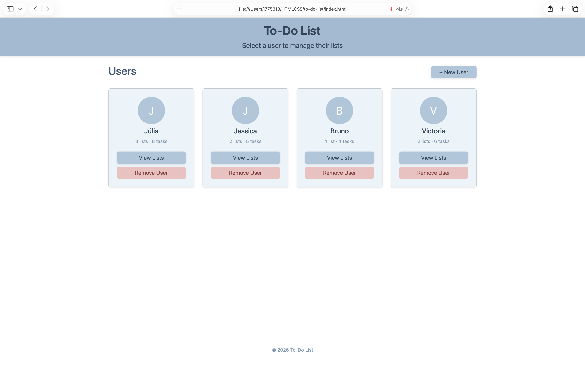
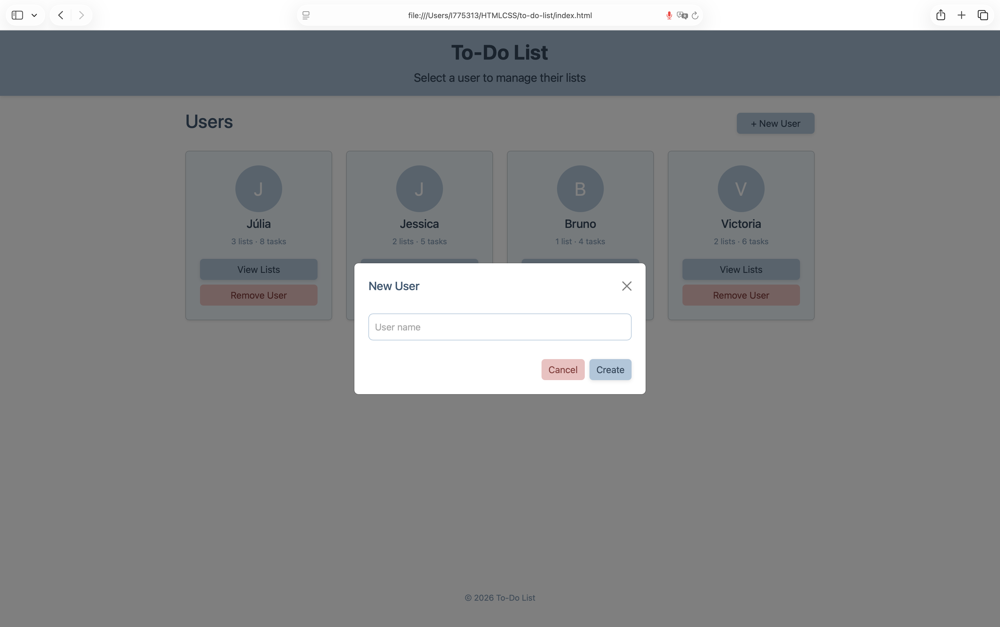
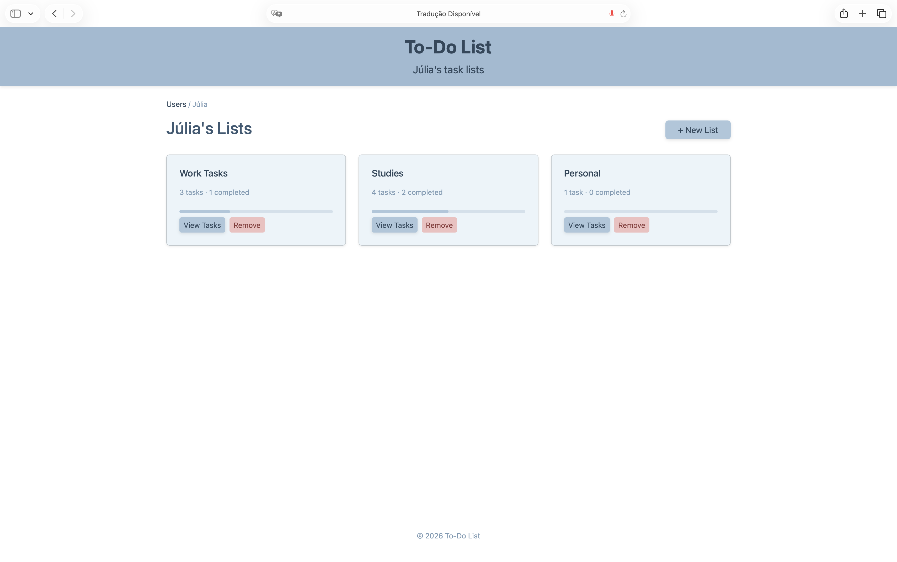
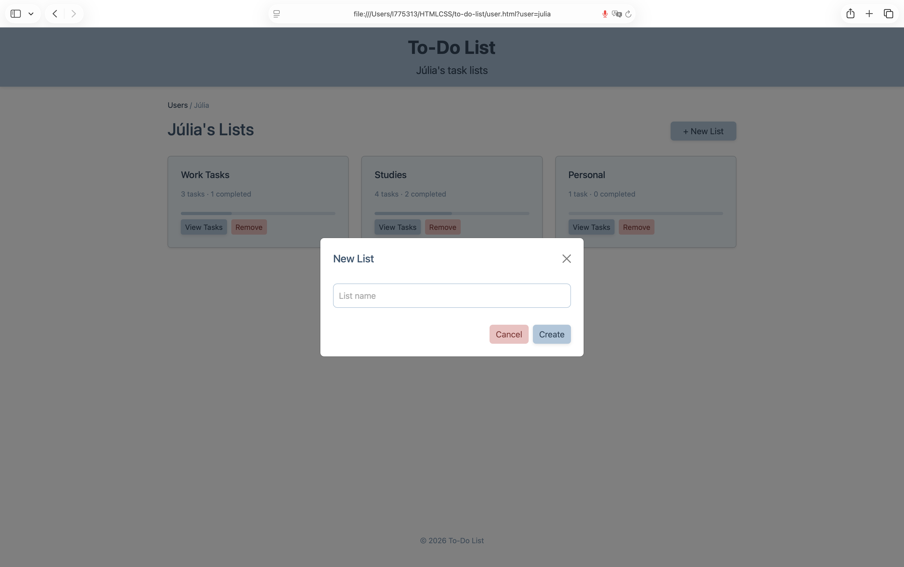
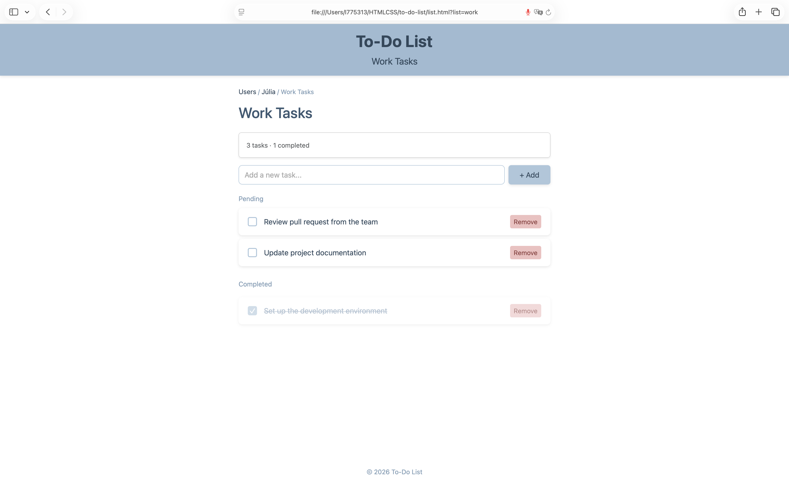

# To-Do List

Um app de lista de tarefas multiusuário feito com HTML, CSS e Bootstrap 5.

## Capturas de tela

### Index


### Adicionar novo usuário


### Listas de tarefas do usuário


### Criar nova lista


### Lista de tarefas


## Páginas

- **index.html** — Lista todos os usuários com a contagem de tarefas
- **user.html** — Exibe todas as listas de tarefas de um usuário específico
- **list.html** — Exibe todas as tarefas de uma lista específica

## Funcionalidades

- Navegar entre usuários e suas listas de tarefas
- Visualizar tarefas com barra de progresso de conclusão
- Marcar e desmarcar tarefas diretamente na página da lista
- Adicionar e remover usuários, listas e tarefas via modais
- Navegação por breadcrumb nas páginas internas
- Layout responsivo com breakpoints em 900px, 700px e 450px

## Estrutura

```
to-do-list/
├── index.html      # Página de usuários
├── user.html       # Página de listas
├── list.html       # Página de tarefas
└── style.css       # Estilos compartilhados
```

## Tecnologias

- [Bootstrap 5.3.3](https://getbootstrap.com/)
- HTML
- CSS
